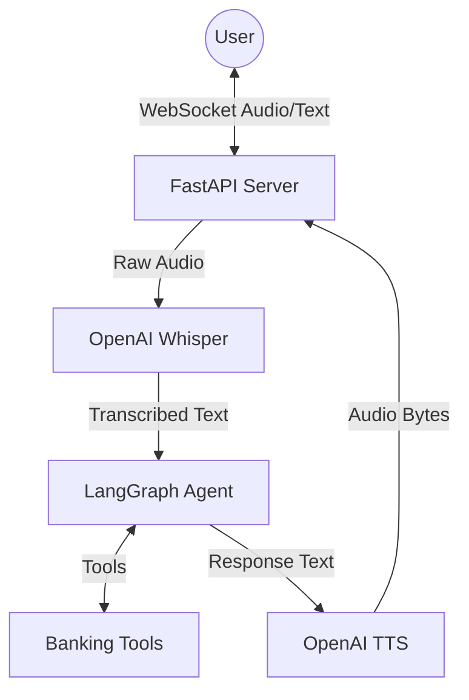
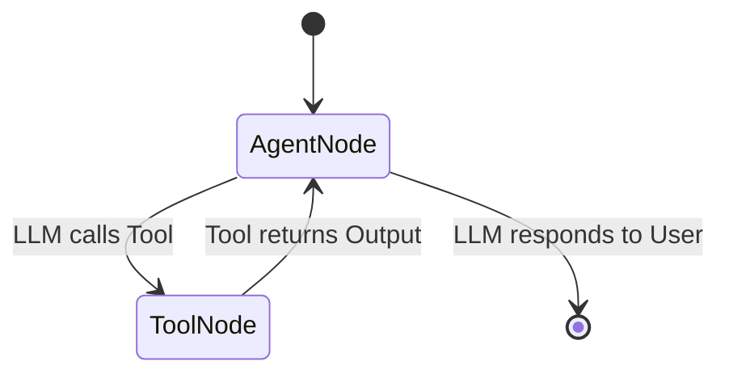

# Voice AI Agent Backend Architecture

This document provides a technical deep dive into the backend architecture of the Voice AI Agent, focusing on the data flow, LangGraph orchestration, and observability via LangSmith.

## High-Level Overview

The system operates as a **Real-time Voice Pipeline** that converts user speech into actionable banking intentions. It uses **WebSockets** for low-latency communication, **OpenAI** for intelligence (STT/LLM/TTS), and **LangGraph** for stateful agentic workflows.



## detailed Request Flow

1.  **Audio Ingest**:
    *   The Frontend sends chunks of audio (WebM) or base64 blobs via WebSocket to `/ws`.
    *   `backend/main.py` receives the payload `{"type": "audio", "data": "..."}`.

2.  **Speech-to-Text (STT)**:
    *   The `transcribe_audio` service receives the bytes.
    *   It calls `OpenAI Whisper` (model `whisper-1`) to convert audio to text.
    *   *Fallback*: If no API key is present, it returns a mock transcript (e.g., "Check my balance").

3.  **Agent Orchestration (LangGraph)**:
    *   The Transcribed Text is wrapped in a `HumanMessage` and sent to the `app_graph`.
    *   The Graph execution cycle begins (see LangGraph section below).

4.  **Action Execution**:
    *   If the LLM decides to function call (e.g., `verify_identity`), LangGraph executes the tool.
    *   The Tool Output is fed back to the LLM.

5.  **Response Generation**:
    *   The LLM generates a final text response (e.g., "Your balance is $2500").

6.  **Text-to-Speech (TTS)**:
    *   The `generate_audio` service takes the text.
    *   It calls `OpenAI TTS` (model `tts-1`) to generate audio bytes.

7.  **Response Delivery**:
    *   The Backend sends a JSON payload back to the client:
        ```json
        {
          "type": "audio",
          "content": "Your balance is $2500",
          "audio": "<base64_encoded_mp3>"
        }
        ```

## LangGraph Orchestration

We use **LangGraph** to model the Agent as a State Machine. This allow us to maintain conversation history and enforce specific workflows (like Verification).

### State Schema
The Agent State tracks:
- `messages`: List of all conversation messages (User, AI, System, Tool).
- `customer_id`: Context of the user (if identified).
- `is_verified`: Boolean flag tracking auth status.

```python
class AgentState(TypedDict):
    messages: List[BaseMessage]
    customer_id: str | None
    is_verified: bool
```

### Graph Logic
The graph consists of two main nodes: **Agent** and **Tools**.



1.  **Agent Node**:
    *   Prefixes the conversation with the `system_persona` from `prompts.json`.
    *   Calls `GPT-4o` with the list of available tools.
    *   Decides whether to reply or call a tool.

2.  **Tool Node**:
    *   Executes the Python functions defined in `backend/tools.py`.
    *   Example: `verify_identity`, `get_account_balance`.

## LangSmith Observability

**LangSmith** provides tracing for every interaction. Since we built the agent with LangChain/LangGraph, tracing is automatic if the environment variables (`LANGCHAIN_TRACING_V2=true`, `LANGCHAIN_API_KEY`) are set.

### What is Traced?
1.  **Input/Output**: Exact text the user said vs. what the audio transcription produced.
2.  **Latency**: How long STT, LLM, and TTS took individually.
3.  **Tool Usage**:
    *   Did the Agent call `verify_identity`?
    *   What arguments were passed? (e.g., `pin="1234"`)
    *   What was the return value?
4.  **Errors**: Stack traces if a tool fails (continuing the conversation gracefully).

### Flow Visualization in LangSmith
You will see a tree structure for every WebSocket turn:
- `Run Graph`
    - `Transcribe` (Custom Span)
    - `LangGraph`
        - `ChatOpenAI` (LLM Call)
        - `ToolExecutor` (if tool used)
            - `verify_identity`
    - `Generate Audio` (Custom Span)
